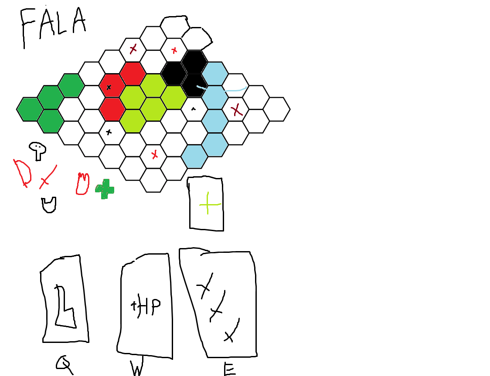

# DeltaSzwagron

## Wybór klas
Na samym początku każdy z graczy wybiera pomiędzy jedną z 4 klas - `Fighter`, `Archer`, `Wizzard` oraz `Healer`.

## Początek rozgrywki
Gracze zostają przesiesieni na mapę stworząną z sześciokątów z losowo ułożonymi strukturami otoczenia oraz losowo ustawionymi oponentami.

## Przebieg rozgrywki
Po pokananiu grupy przeciwników gracze wybierają jeden spośród trzech losowych ulepszeń umiejętności, a struktury na mapie są ponownie generowane oraz pojawia się kolejna silniejsza grupa wrogów. Co piątą falę gracze bądą walczyć z `bossem`.

## Cel gry
Celem gry jest pokonanie szóstego bossa - `Króla koni`.
